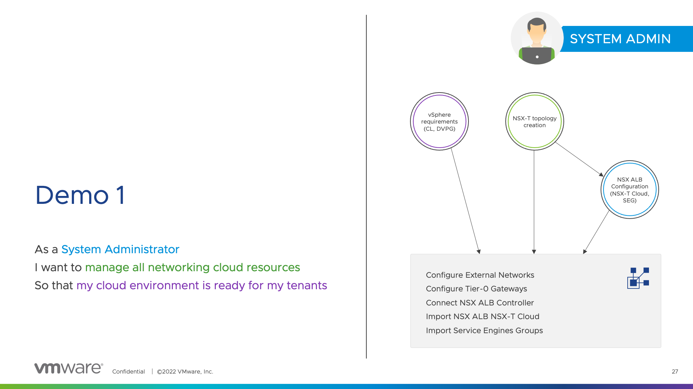
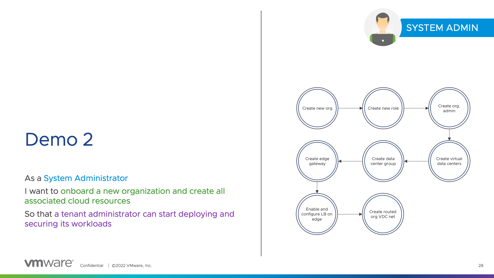

# System Administrator Persona - Demos #1 and #2

## Demo #1

The demo #1 consists of creating required infrastructure resources so that  The scope is the following:

* Creating all requirements (vSphere Content Library, NSX-T management infrastructure for the Avi NSX-T Cloud, etc.)
* NSX Advanced Load Balancer
  * NSX-T Cloud creation
  * Services Engines Groups configuration
* VMware Cloud Director configuration (external networks, tier-0 gateways, etc.)

```
As a System Administrator
I want to manage all networking cloud resources
So that my cloud environment is ready for my tenants
```



Terraform providers used:

* `hashicorp/vsphere`
* `vmware/avi`
* `vmware/nsxt`
* `vmware/vcd`

## Demo #2

The demo #2 consists of onboarding a new tenant by creating the organization, virtual data centers, edge gateways, etc.

```
As a System Administrator
I want to onboard a new organization and create all associated cloud resources
So that a tenant administrator can start deploying and securing its workloads
```



Terraform provider used:

* `vmware/vcd`
