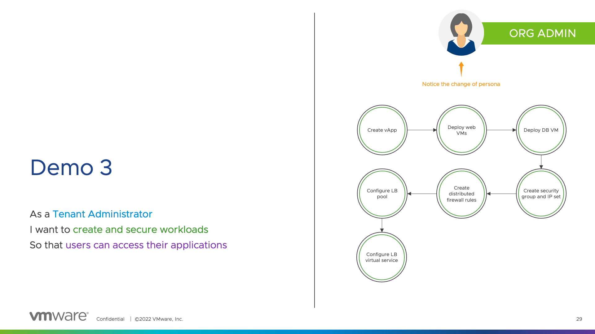

# Tenant Administrator Persona - Demo #3

## Demo #3

The demo #3 consists of a vApp deployment by a tenant administrator, including associated security groups, IP set and distributed firewall rules.

For the sake of time, I create empty VMs in the demo #3. However, it's easy to upload an OVA (or an ISO) and build vApps and VMs with it.

```
As a Tenant Administrator
I want to create and secure workloads
So that users can access their applications
```



Terraform provider used:

* `vmware/vcd`
